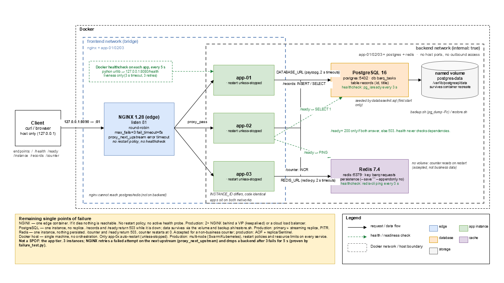

# BARQ Systems — DevOps Infrastructure Assessment


## Overview

This repository contains the completed BARQ Systems DevOps Internship infrastructure assessment.

The project is a containerized Flask application backed by PostgreSQL and Redis, with NGINX acting as the only publicly exposed entry point.

The final architecture includes:

* NGINX reverse proxy
* Three Flask application instances
* PostgreSQL with persistent named storage
* Redis for application state/counter operations
* Separate frontend and backend Docker networks
* Health and readiness checks
* Validation and failure-test scripts
* PostgreSQL backup and restore procedures
* CI validation
* Troubleshooting and log-analysis documentation

The environment is intended for a disposable local lab only.

---

## Architecture


### Request flow

The client connects only to NGINX through host port `8090`.

NGINX listens on container port `81` and forwards requests to the Flask application instances on port `8080`.

The application containers can communicate with PostgreSQL and Redis through the backend network.

PostgreSQL and Redis are not published to the host.

### Networks

* `barq-assessment_frontend`

  * NGINX
  * app-01
  * app-02
  * app-03

* `barq-assessment_backend`

  * app-01
  * app-02
  * app-03
  * PostgreSQL
  * Redis

The backend network is internal and is not directly reachable from the host.

---

## Prerequisites

Recommended environment:

* Linux or WSL2
* Python 3.12+
* Git
* Docker Desktop with Linux containers
* Docker Compose

Suggested minimum capacity:

* 2 CPU cores
* 4 GB free RAM
* 3 GB free disk space plus Docker overhead

Run shell commands from Linux/WSL.

---

## Configuration and Secrets

Application configuration is loaded from:

```text
config/app.env
```

PostgreSQL credentials are kept outside the tracked Compose file in:

```text
config/postgres.env
```

The PostgreSQL environment file must not be committed.

Verify that it is ignored:

```bash
git check-ignore -v config/postgres.env
```

Verify that Git is not tracking it:

```bash
git ls-files config/postgres.env
```

The second command should produce no output.

For production deployments, credentials should be provided through a proper secrets-management mechanism such as Docker secrets, Kubernetes Secrets, or a cloud secrets manager.

---

## Start the Environment

From the repository root:

```bash
git status
git log -2 --oneline
docker version
docker compose version
```

Build and start the final environment on the required public port:

```bash
PUBLIC_PORT=8090 docker compose up --build -d
```

Check service status:

```bash
docker compose ps -a
```

Check logs:

```bash
docker compose logs --no-color
```

---

## Health and Readiness

The application exposes:

### `/health`

Basic application health.

```bash
curl -i http://127.0.0.1:8090/health
```

Expected result:

```text
HTTP/1.1 200 OK
```

### `/ready`

Checks application dependencies, including PostgreSQL and Redis.

```bash
curl -i http://127.0.0.1:8090/ready
```

A successful response should return:

```text
HTTP/1.1 200 OK
```

The readiness check is different from `/health`:

* `/health` confirms that the Flask process is alive.
* `/ready` confirms that required dependencies are available.

---

## API Testing

### Root endpoint

```bash
curl -i http://127.0.0.1:8090/
```

### Health

```bash
curl -i http://127.0.0.1:8090/health
```

### Readiness

```bash
curl -i http://127.0.0.1:8090/ready
```

### Instance identity

Run this several times:

```bash
for i in {1..12}; do
  curl -s http://127.0.0.1:8090/instance
  echo
done
```

The responses should include the identities of:

```text
app-01
app-02
app-03
```

This demonstrates that NGINX is distributing requests across the application pool.

### Records

Create a record:

```bash
curl -i -X POST http://127.0.0.1:8090/records \
  -H 'Content-Type: application/json' \
  -d '{"name":"assessment-record"}'
```

Then retrieve records:

```bash
curl -i http://127.0.0.1:8090/records
```

### Redis counter

```bash
curl -i http://127.0.0.1:8090/counter
```

---

## Failure Test

The application pool is designed to continue serving traffic when one application instance fails.

Stop one backend instance:

```bash
docker compose stop app-01
```

Continue sending requests:

```bash
for i in {1..20}; do
  curl -s -o /dev/null -w "%{http_code}\n" \
    http://127.0.0.1:8090/health
done
```

Traffic should continue through the remaining healthy instances.

Check the running services:

```bash
docker compose ps
```

Restore the stopped instance:

```bash
docker compose start app-01
```

Wait for it to become healthy:

```bash
docker compose ps
```

Then verify that it serves traffic again:

```bash
for i in {1..12}; do
  curl -s http://127.0.0.1:8090/instance
  echo
done
```

The returned instance identities should again include `app-01`.

---

## Persistence Test

PostgreSQL data is stored in the named volume:

```text
postgres-data
```

Create a test record:

```bash
curl -s -X POST http://127.0.0.1:8090/records \
  -H 'Content-Type: application/json' \
  -d '{"name":"persistence-test"}'
```

Verify it exists:

```bash
curl -s http://127.0.0.1:8090/records
```

Recreate the application containers:

```bash
docker compose up -d --force-recreate app-01 app-02 app-03
```

Recreate PostgreSQL without removing its volume:

```bash
docker compose up -d --force-recreate postgres
```

Verify the record again:

```bash
curl -s http://127.0.0.1:8090/records
```

The `persistence-test` record should still exist.

Do **not** use:

```bash
docker compose down -v
```

during persistence testing because that removes named volumes.

---

## PostgreSQL Backup

Run:

```bash
./backup.sh
```

The backup script creates a PostgreSQL dump using the running PostgreSQL service.

Confirm the generated backup:

```bash
ls -lh backups/
```

Backups are local assessment artifacts and must not be committed.

---

## PostgreSQL Restore

The restore process is intended to demonstrate that a PostgreSQL backup can be restored successfully.

Run:

```bash
./restore.sh
```

Follow the script output and verify the restored data:

```bash
curl -s http://127.0.0.1:8090/records
```

The restore procedure should be tested against the disposable assessment environment only.

---

## Automated Validation

Run:

```bash
./validate.sh
```

The validation script checks the important runtime properties of the deployment.

A successful run should finish with PASS results and exit with status `0`.

Check the exit status:

```bash
echo $?
```

A non-zero exit status indicates validation failure.

Validation covers the externally reachable service, application endpoints, service readiness, network exposure, and required infrastructure behavior.

A green validation result demonstrates that the tested checks passed at that point in time. It does not by itself prove production-level availability, security, disaster recovery, or performance.

---

## Failure Test Script

Run:

```bash
./failure_test.sh
```

The failure test verifies behavior when an application instance is stopped and then restored.

The test should demonstrate:

1. One backend instance becomes unavailable.
2. NGINX continues serving traffic through healthy instances.
3. The failed instance is restored.
4. The restored instance becomes healthy.
5. Traffic can reach it again.

---

## Local App Tests

The application also contains tests that do not require real PostgreSQL, Redis, or Docker networking.

Create and activate the virtual environment:

```bash
python3 -m venv .venv
source .venv/bin/activate
```

Install dependencies:

```bash
python -m pip install -r requirements.txt
```

Run tests:

```bash
python -m unittest discover -s tests -v
```

---

## Log Analysis

The historical logs were analyzed before changing the infrastructure.

### Access log

The access log contained:

* 726 total lines
* 725 valid JSON records
* 1 malformed record
* 5 exact duplicate records
* 720 distinct clients for the selected denominator

Final HTTP status counts:

| Status | Count |
| ------ | ----: |
| 200    |   615 |
| 404    |    10 |
| 502    |    40 |
| 503    |    47 |
| 504    |     8 |

There were 105 error responses.

Using 720 as the distinct-client denominator:

```text
105 / 720 × 100 = 14.58%
```

### Error log

The error log contained:

* 68 total lines
* 67 parsed records
* 59 connection-refused events
* 8 upstream-timeout events

### 502 window

The observed 502 errors occurred during:

```text
11:05:02.503Z – 11:09:57.503Z
```

The affected upstream was:

```text
172.23.0.12
```

This pointed toward an unhealthy or unreachable application upstream rather than a client-side HTTP problem.

### Dependency errors

Dependency errors occurred during:

```text
11:12:09Z – 11:21:45Z
```

Examples included:

* Redis `TimeoutError`
* PostgreSQL `InvalidPassword`

These findings helped separate reverse-proxy/upstream failures from application dependency failures.

### Latency

For the analyzed request-time entries:

```text
Median: 0.051 seconds
P95:    0.120 seconds
```

Latency statistics were calculated from the parsed request-time records rather than treating every log line as a unique client request.

### Avoiding double counting

Log analysis must distinguish between:

* log lines
* valid records
* duplicate records
* unique clients
* individual requests

Retries and duplicate log records can otherwise make an incident appear larger than it actually was.

The analysis scripts therefore parse the structured fields instead of simply counting every line.

---

## Troubleshooting Findings

### 1. Incorrect application health endpoint

The original Compose healthcheck used:

```text
/healthz
```

The Flask application actually exposed:

```text
/health
```

The healthcheck was corrected and the application containers became healthy.

---

### 2. NGINX port and upstream mismatch

The original NGINX configuration did not match the ports used by the Flask application and Compose mapping.

The application listens on:

```text
8080
```

NGINX listens inside the container on:

```text
81
```

The host exposes:

```text
8090 -> 81
```

The NGINX upstream therefore uses:

```text
app-01:8080
app-02:8080
app-03:8080
```

This separates the host-facing port from the internal application port.

---

### 3. Container networking

The Flask application binds to:

```text
0.0.0.0:8080
```

This is required so that other containers can reach the application through the Docker network.

Binding only to:

```text
127.0.0.1
```

would make the application reachable from inside its own container but not from other containers.

---

## Timeouts, Retries and Restart Policies

The infrastructure uses bounded timeouts to prevent failed dependencies from holding requests indefinitely.

Examples include:

* PostgreSQL connection timeout
* PostgreSQL statement timeout
* Redis timeout
* NGINX proxy connection timeout
* NGINX proxy read timeout

NGINX can retry another upstream when an upstream connection or timeout failure occurs.

Application containers use a restart policy so that unexpected application-process failures can recover automatically.

Resource limits should also be applied so that one container cannot consume unlimited host resources.

These mechanisms improve resilience but do not eliminate the underlying failure.

---

## Security

The deployment follows these principles:

* Only NGINX is published to the host.
* PostgreSQL is not host-published.
* Redis is not host-published.
* The backend network is internal.
* Application containers use a non-root runtime user.
* Unnecessary privileges are avoided.
* Secrets are not intended to be stored in the repository.
* Local secret files are ignored by Git.
* Only synthetic lab data is used.

### PostgreSQL credential issue

The original configuration contained a PostgreSQL password directly in the Compose file.

**Risk and evidence:**

A database credential was present as plaintext configuration in `docker-compose.yml`.

**Impact:**

Anyone with access to the repository could obtain the credential and potentially use it against the database if network access were available.

**Implemented fix / commit:**

The PostgreSQL credential was moved into a local ignored environment file:

```text
config/postgres.env
```

The Compose configuration loads the values without keeping the password in the tracked Compose file.

**Production follow-up:**

Use Docker secrets, Kubernetes Secrets, or a managed cloud secrets service instead of local environment files.

**How to verify:**

```bash
git check-ignore -v config/postgres.env
git ls-files config/postgres.env
```

The secret file should be ignored and untracked.

---

## Remaining Single Points of Failure

The final architecture still contains several single points of failure:

### NGINX

There is currently one NGINX instance.

**Production improvement:** use multiple reverse-proxy/load-balancer instances behind a redundant load-balancing layer.

### PostgreSQL

There is one PostgreSQL instance.

**Production improvement:** use PostgreSQL replication/HA or a managed highly available database service.

### Redis

There is one Redis instance.

**Production improvement:** use Redis replication/sentinel/cluster or a managed HA Redis service depending on workload requirements.

### Docker host

All containers currently depend on the same Docker host.

**Production improvement:** distribute critical components across redundant hosts or an orchestrated environment.

---

## CI

The repository contains a GitHub Actions workflow:

```text
.github/workflows/ci.yml
```

The CI workflow is intended to automatically run the available validation checks.

A passing CI run proves that the configured automated checks passed in the CI environment.

It does not prove:

* production-scale performance
* full disaster recovery
* external network behavior
* long-term availability
* operational readiness
* security against all attack classes

---

## Architecture Diagram

The repository contains the final architecture diagram:

```text
architecture.png
```

The diagram represents:

* client
* NGINX
* app-01
* app-02
* app-03
* PostgreSQL
* Redis
* port `8090`
* internal application port `8080`
* PostgreSQL port `5432`
* Redis port `6379`
* frontend network
* backend network
* PostgreSQL persistent storage
* request and dependency flow

---

## Recorded Challenge

The supplied challenge script is:

```bash
./video_challenge.sh
```

It should be run only once in the video working copy as required by the assessment.

Do not use:

```bash
docker compose down
```

to reset the runtime challenge.

The recorded challenge demonstrates:

* repository state
* service startup
* health/readiness
* API endpoints
* load balancing
* backend failure and recovery
* PostgreSQL persistence
* validation
* historical log findings
* runtime troubleshooting
* live public-port change from `8080` to `8090`
* adding the third application instance
* final validation
* Git status/diff/history

---

## Live Port Change

The final public port is:

```text
8090
```

Start the final configuration with:

```bash
PUBLIC_PORT=8090 docker compose up -d
```

Verify:

```bash
curl -i http://127.0.0.1:8090/health
```

The host port is controlled by:

```text
PUBLIC_PORT
```

The Flask application remains on its internal port:

```text
8080
```

This means changing the public port does not require changing the Flask application port.

---

## Adding the Third Application Instance

The final Compose configuration contains:

```text
app-01
app-02
app-03
```

All three applications listen internally on:

```text
8080
```

NGINX distributes requests between them.

Verify:

```bash
docker compose ps
```

Then:

```bash
for i in {1..20}; do
  curl -s http://127.0.0.1:8090/instance
  echo
done
```

The responses should demonstrate all three instance identities.

Run validation again:

```bash
./validate.sh
```

---

## Cleanup

To stop the assessment environment:

```bash
docker compose down
```

This removes the containers and networks but preserves named volumes.

Do not remove the PostgreSQL volume if persistence needs to be preserved.

To intentionally remove the PostgreSQL named volume after the assessment:

```bash
docker compose down -v
```

Use this only when the stored lab data is no longer required.

Avoid global Docker cleanup commands such as:

```bash
docker system prune
```

because they may affect unrelated Docker resources.

---

## Git and Evidence

Changes were committed progressively rather than as one final commit.

The implementation history includes commits covering:

* secret handling
* PostgreSQL persistence
* Redis configuration
* Redis persistence decision
* application restart policy
* unnecessary root privileges
* official image health checks
* service and HTTP readiness validation
* backup and restore

Inspect the history with:

```bash
git log --oneline --decorate
```

Inspect the current state with:

```bash
git status
git diff
```

The assessment evidence should connect each major change to its corresponding commit and recorded verification.

---

## AI Usage Disclosure

AI was used as a technical support resource during the assessment.

### Tool/model:

ChatGPT (GPT-5.6 Luna)

### Purpose:

Supporting technical work involving Docker/Compose networking, NGINX reverse proxy configuration, health/readiness checks, log analysis, troubleshooting, security considerations, documentation, and validation.

### Files or decisions affected:

`docker-compose.yml`, NGINX configuration, validation scripts, backup/restore scripts, infrastructure configuration, security documentation, and assessment documentation.

### What you changed or rejected:

AI suggestions were reviewed and adapted rather than copied blindly. Changes included correcting the Redis internal port, PostgreSQL persistence, restart behavior, root privileges, health/readiness checks, backup/restore behavior, and PostgreSQL credential handling.

### How you independently verified it:

Commands were executed manually in WSL and Docker. Verification included `docker compose`, `curl`, NGINX configuration tests, container health checks, API endpoint tests, log inspection, validation scripts, Git diff, and Git history.

### Related commits:

* `98162d2`
* `ca0970f`
* `ecbbbc9`
* `8cc613c`
* `36adecf`
* `7d9ced5`
* `950f40c`
* `c627932`
* `e75d236`
